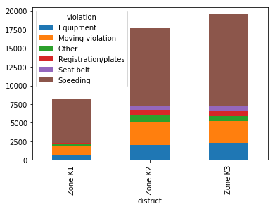

# dc_police-activity
Analyzing police activity in Rhode Island using Python's pandas package.


# Analyzing Police Activity with pandas

## Project Description

### This project explores the Stanford Open Policing Project dataset and analyzes the impact of weather, time of day, reason for traffic stop and gender of driver on police behavior. It covers cleaning messy data, creating visualizations, combining and reshaping datasets, and manipulating time series data.

### Preparing data for analysis

#### Before beginning the analysis, it is critical to first examine and clean the dataset, to make working with it a more efficient process. This chapter covers fixing data types, handling missing values, and dropping columns and rows while learning about the Stanford Open Policing Project dataset. 

The dataset contains traffic stops by police officers, collected by the Stanford Open Policing Project. It has data on 31 US states. This project focuses on data from the state of Rhode Island. The full data can be downloaded from the project's website at https://openpolicing.stanford.edu/


```python
from IPython.display import Image
Image(filename='data/states.png')
```


Before beginning your analysis, it's important that we familiarize ourselves with the dataset. 


```python
# Import the pandas library as pd
import pandas as pd

# Read 'police.csv' into a DataFrame named ri
ri = pd.read_csv('data/police.csv')

# Examine the head of the DataFrame
print(ri.head())

# Count the number of missing values in each column
print(ri.isnull().sum())
```

      state   stop_date stop_time  county_name driver_gender driver_race  \
    0    RI  2005-01-04     12:55          NaN             M       White   
    1    RI  2005-01-23     23:15          NaN             M       White   
    2    RI  2005-02-17     04:15          NaN             M       White   
    3    RI  2005-02-20     17:15          NaN             M       White   
    4    RI  2005-02-24     01:20          NaN             F       White   
    
                        violation_raw  violation  search_conducted search_type  \
    0  Equipment/Inspection Violation  Equipment             False         NaN   
    1                        Speeding   Speeding             False         NaN   
    2                        Speeding   Speeding             False         NaN   
    3                Call for Service      Other             False         NaN   
    4                        Speeding   Speeding             False         NaN   
    
        stop_outcome is_arrested stop_duration  drugs_related_stop district  
    0       Citation       False      0-15 Min               False  Zone X4  
    1       Citation       False      0-15 Min               False  Zone K3  
    2       Citation       False      0-15 Min               False  Zone X4  
    3  Arrest Driver        True     16-30 Min               False  Zone X1  
    4       Citation       False      0-15 Min               False  Zone X3  
    state                     0
    stop_date                 0
    stop_time                 0
    county_name           91741
    driver_gender          5205
    driver_race            5202
    violation_raw          5202
    violation              5202
    search_conducted          0
    search_type           88434
    stop_outcome           5202
    is_arrested            5202
    stop_duration          5202
    drugs_related_stop        0
    district                  0
    dtype: int64
    

It looks like most of the columns have at least some missing values.

Often, a DataFrame will contain columns that are not useful to your analysis. Such columns should be dropped from the DataFrame, to make it easier for you to focus on the remaining columns. In this case, the state and the county_name columns are non-relevant, since we only focus on data from Rhode Island.


```python
# Examine the shape of the DataFrame
print(ri.shape)

# Drop the 'county_name' and 'state' columns
ri.drop(['county_name', 'state'], axis='columns', inplace=True)

# Examine the shape of the DataFrame (again)
print(ri.shape)
```

    (91741, 15)
    (91741, 13)
    

When you know that a specific column will be critical to your analysis, and only a small fraction of rows are missing a value in that column, it often makes sense to remove those rows from the dataset.
During this project, the `driver_gender` column will be critical to many of our analyses. Because only a small fraction of rows are missing `driver_gender`, we'll drop those rows from the dataset.


```python
# Count all observations with non-missing and missing 'driver_gender'
print(ri.driver_gender.count())
print(ri.driver_gender.isnull().sum())
```

    86536
    5205
    


```python
# Drop all rows that are missing 'driver_gender'
ri.dropna(subset=['driver_gender'], inplace=True)

# Count the number of missing values in each column (again)
print(ri.isnull().sum())

# Examine the shape of the DataFrame
print(ri.shape)
```

    stop_date                 0
    stop_time                 0
    driver_gender             0
    driver_race               0
    violation_raw             0
    violation                 0
    search_conducted          0
    search_type           83229
    stop_outcome              0
    is_arrested               0
    stop_duration             0
    drugs_related_stop        0
    district                  0
    dtype: int64
    (86536, 13)
    

We dropped around 5,000 rows, which is a small fraction of the dataset, and now only one column remains with any missing values.

The data types of features were automatically inferred by `pandas` when reading in the *.csv* file. The data types currently in use are only `object` and `bool`. As data types affect which operations we can perform on a given Series, we should examine and fix data types in our dataset.


```python
ri.dtypes
```


    stop_date             object
    stop_time             object
    driver_gender         object
    driver_race           object
    violation_raw         object
    violation             object
    search_conducted        bool
    search_type           object
    stop_outcome          object
    is_arrested           object
    stop_duration         object
    drugs_related_stop      bool
    district              object
    dtype: object


The `is_arrested` column currently has the object data type. We'll change the data type to bool, which is the most suitable type for a column containing `True` and `False` values.
Fixing the data type will enable us to use mathematical operations on the `is_arrested` column that would not be possible otherwise.


```python
# Examine the head of the 'is_arrested' column
print(ri.is_arrested.head())

# Check the data type of 'is_arrested'
print(ri.is_arrested.dtype)

# Change the data type of 'is_arrested' to 'bool'
ri['is_arrested'] = ri.is_arrested.astype(bool)

# Check the data type of 'is_arrested' (again)
print(ri.is_arrested.dtype)
```

    0    False
    1    False
    2    False
    3     True
    4    False
    Name: is_arrested, dtype: object
    object
    bool
    

The date and time of each traffic stop are stored in separate columns, both of which are object columns.


```python
print(ri.iloc[:, 0:4].head())
print(ri.stop_date.dtype, ri.stop_time.dtype)
```

        stop_date stop_time driver_gender driver_race
    0  2005-01-04     12:55             M       White
    1  2005-01-23     23:15             M       White
    2  2005-02-17     04:15             M       White
    3  2005-02-20     17:15             M       White
    4  2005-02-24     01:20             F       White
    object object
    

We will combine them into a single column and then convert it to a `pandas` `datetime` format. This `datetime` column will function as the `Index` of the dataFrame, that will make it easier to filter and plot it by date.


```python
# Concatenate 'stop_date' and 'stop_time' (separated by a space)
combined = ri.stop_date.str.cat(ri.stop_time, sep = ' ')

# Convert 'combined' to datetime format
ri['stop_datetime'] = pd.to_datetime(combined)

# Examine the data type of 'stop_datetime'
print(ri.stop_datetime.dtype)
```

    datetime64[ns]
    


```python
# Set 'stop_datetime' as the index
ri.set_index('stop_datetime', inplace=True)

# Examine the index
print(ri.index)

# Examine the columns ('stop_datetime' is no longer one of the columns)
print(ri.columns)
```

    DatetimeIndex(['2005-01-04 12:55:00', '2005-01-23 23:15:00',
                   '2005-02-17 04:15:00', '2005-02-20 17:15:00',
                   '2005-02-24 01:20:00', '2005-03-14 10:00:00',
                   '2005-03-29 21:55:00', '2005-04-04 21:25:00',
                   '2005-07-14 11:20:00', '2005-07-14 19:55:00',
                   ...
                   '2015-12-31 13:23:00', '2015-12-31 18:59:00',
                   '2015-12-31 19:13:00', '2015-12-31 20:20:00',
                   '2015-12-31 20:50:00', '2015-12-31 21:21:00',
                   '2015-12-31 21:59:00', '2015-12-31 22:04:00',
                   '2015-12-31 22:09:00', '2015-12-31 22:47:00'],
                  dtype='datetime64[ns]', name='stop_datetime', length=86536, freq=None)
    Index(['stop_date', 'stop_time', 'driver_gender', 'driver_race',
           'violation_raw', 'violation', 'search_conducted', 'search_type',
           'stop_outcome', 'is_arrested', 'stop_duration', 'drugs_related_stop',
           'district'],
          dtype='object')
    

Now that we have cleaned the dataset, we can begin analyzing it!

### Exploring the relationship between gender and policing

#### Does the gender of a driver have an impact on police behavior during a traffic stop? In this chapter, we explore that question while practicing filtering, grouping, method chaining, Boolean math, string methods, and more! 

Before comparing the violations being committed by each gender, we should examine the violations committed by all drivers to get a baseline understanding of the data.


```python
# Count the unique values in 'violation'
print(ri.violation.value_counts())

print('-------------------------------')

# Express the counts as proportions
print(ri.violation.value_counts(normalize = True))
```

    Speeding               48423
    Moving violation       16224
    Equipment              10921
    Other                   4409
    Registration/plates     3703
    Seat belt               2856
    Name: violation, dtype: int64
    -------------------------------
    Speeding               0.559571
    Moving violation       0.187483
    Equipment              0.126202
    Other                  0.050950
    Registration/plates    0.042791
    Seat belt              0.033004
    Name: violation, dtype: float64
    

Interesting! More than half of all violations are for speeding, followed by other moving violations and equipment violations.

The question we're trying to answer is whether male and female drivers tend to commit different types of traffic violations.
In order to answer that, first we create a DataFrame for each gender, and then analyze the violations in each DataFrame separately.


```python
# Create a DataFrame of female drivers
female = ri[ri.driver_gender == 'F']

# Create a DataFrame of male drivers
male = ri[ri.driver_gender == 'M']

# Compute the violations by female drivers (as proportions)
print(female.violation.value_counts(normalize = True))


print('-------------------------------')

# Compute the violations by male drivers (as proportions)
print(male.violation.value_counts(normalize = True))
```

    Speeding               0.658114
    Moving violation       0.138218
    Equipment              0.105199
    Registration/plates    0.044418
    Other                  0.029738
    Seat belt              0.024312
    Name: violation, dtype: float64
    -------------------------------
    Speeding               0.522243
    Moving violation       0.206144
    Equipment              0.134158
    Other                  0.058985
    Registration/plates    0.042175
    Seat belt              0.036296
    Name: violation, dtype: float64
    

About two-thirds of female traffic stops are for speeding, whereas stops of males are more balanced among the six categories. This doesn't mean that females speed more often than males, however, since we didn't take into account the number of stops or drivers.

When a driver is pulled over for speeding, many people believe that gender has an impact on whether the driver will receive a ticket or a warning. Can we find evidence of this in the dataset?

First, we'll create two DataFrames of drivers who were stopped for speeding: one containing females and the other containing males.
Then, for each gender, we'll use the `stop_outcome` column to calculate what percentage of stops resulted in a *"Citation"* (meaning a ticket) versus a *"Warning"*.


```python
# Create a DataFrame of female drivers stopped for speeding
female_and_speeding = ri[(ri.driver_gender == 'F') & (ri.violation == 'Speeding')]

# Create a DataFrame of male drivers stopped for speeding
male_and_speeding = ri[(ri.driver_gender == 'M') & (ri.violation == 'Speeding')]

# Compute the stop outcomes for female drivers (as proportions)
print(female_and_speeding.stop_outcome.value_counts(normalize = True))

print('----------------------------------')

# Compute the stop outcomes for male drivers (as proportions)
print(male_and_speeding.stop_outcome.value_counts(normalize = True))
```

    Citation            0.952192
    Warning             0.040074
    Arrest Driver       0.005752
    N/D                 0.000959
    Arrest Passenger    0.000639
    No Action           0.000383
    Name: stop_outcome, dtype: float64
    ----------------------------------
    Citation            0.944595
    Warning             0.036184
    Arrest Driver       0.015895
    Arrest Passenger    0.001281
    No Action           0.001068
    N/D                 0.000976
    Name: stop_outcome, dtype: float64
    

Interesting! The numbers are similar for males and females: about 95% of stops for speeding result in a ticket. Thus, the data fails to show that gender has an impact on who gets a ticket for speeding.

During a traffic stop, the police officer sometimes conducts a search of the vehicle. Does the driver's gender affect whether their vehicle is searched? Let's calculate the percentage of all stops that result in a vehicle search, also known as the search rate.


```python
# Check the data type of 'search_conducted'
print(ri.search_conducted.dtype)

# Calculate the search rate by taking the mean
print(ri.search_conducted.mean())
```

    bool
    0.0382153092354627
    

It looks like the overall search rate is about 3.8%. Now we compare the rates at which female and male drivers are searched.


```python
# Calculate the search rate for both groups simultaneously
print(ri.groupby('driver_gender').search_conducted.mean())
```

    driver_gender
    F    0.019181
    M    0.045426
    Name: search_conducted, dtype: float64
    

Wow! Male drivers are searched more than twice as often as female drivers. Why might this be?

Even though the search rate for males is much higher than for females, it's possible that the difference is mostly due to a second factor.
For example, we might hypothesize that the search rate varies by violation type, and the difference in search rate between males and females is because they tend to commit different violations.
We can test this hypothesis by examining the search rate for each combination of gender and violation. If the hypothesis was true, we would find that males and females are searched at about the same rate for each violation.


```python
# Calculate the search rate for each combination of violation and gender
print(ri.groupby(['violation', 'driver_gender']).search_conducted.mean())
```

    violation            driver_gender
    Equipment            F                0.039984
                         M                0.071496
    Moving violation     F                0.039257
                         M                0.061524
    Other                F                0.041018
                         M                0.046191
    Registration/plates  F                0.054924
                         M                0.108802
    Seat belt            F                0.017301
                         M                0.035119
    Speeding             F                0.008309
                         M                0.027885
    Name: search_conducted, dtype: float64
    

For all types of violations, the search rate is higher for males than for females, disproving our hypothesis.

During a vehicle search, the police officer may pat down the driver to check if they have a weapon. This is known as a "protective frisk." First, we should check the different types of activities carried out during a search.


```python
# Count the 'search_type' values
print(ri.search_type.value_counts())
```

    Incident to Arrest                                          1290
    Probable Cause                                               924
    Inventory                                                    219
    Reasonable Suspicion                                         214
    Protective Frisk                                             164
    Incident to Arrest,Inventory                                 123
    Incident to Arrest,Probable Cause                            100
    Probable Cause,Reasonable Suspicion                           54
    Incident to Arrest,Inventory,Probable Cause                   35
    Probable Cause,Protective Frisk                               35
    Incident to Arrest,Protective Frisk                           33
    Inventory,Probable Cause                                      25
    Protective Frisk,Reasonable Suspicion                         19
    Incident to Arrest,Inventory,Protective Frisk                 18
    Incident to Arrest,Probable Cause,Protective Frisk            13
    Inventory,Protective Frisk                                    12
    Incident to Arrest,Reasonable Suspicion                        8
    Probable Cause,Protective Frisk,Reasonable Suspicion           5
    Incident to Arrest,Probable Cause,Reasonable Suspicion         5
    Incident to Arrest,Inventory,Reasonable Suspicion              4
    Inventory,Reasonable Suspicion                                 2
    Incident to Arrest,Protective Frisk,Reasonable Suspicion       2
    Inventory,Probable Cause,Protective Frisk                      1
    Inventory,Protective Frisk,Reasonable Suspicion                1
    Inventory,Probable Cause,Reasonable Suspicion                  1
    Name: search_type, dtype: int64
    

There were 164 cases where ONLY Protective Frisk was done. In other cases, there were multiple actions taken, resulting in a comma-separated representation of those actions. We can collect all cases when drivers were frisked using a string function.


```python
# Check if 'search_type' contains the string 'Protective Frisk'
ri['frisk'] = ri.search_type.str.contains('Protective Frisk', na = False)

# Check the data type of 'frisk'
print(ri.frisk.dtype)

# Take the sum of 'frisk'
print(ri.frisk.sum())
```

    bool
    303
    

It looks like there were 303 drivers who were frisked. Are males frisked more often than females, perhaps because police officers consider them to be higher risk? Next, we'll examine whether gender affects who is frisked.


```python
# Create a DataFrame of stops in which a search was conducted
searched = ri[ri.search_conducted == True]

# Calculate the overall frisk rate by taking the mean of 'frisk'
print(searched.frisk.mean())

# Calculate the frisk rate for each gender
print(searched.groupby('driver_gender').frisk.mean())
```

    0.09162382824312065
    driver_gender
    F    0.074561
    M    0.094353
    Name: frisk, dtype: float64
    

Interesting! The frisk rate is higher for males than for females, though we can't conclude that this difference is caused by the driver's gender, as [correlation does not imply causation](https://towardsdatascience.com/correlation-causation-how-alcohol-affects-life-expectancy-a68f7db943f8).

### Visual exploratory data analysis

#### Are you more likely to get arrested at a certain time of day? Are drug-related stops on the rise? In this chapter, we will answer these and other questions by analyzing the dataset visually, since plots can help you to understand trends in a way that examining the raw data cannot. 

When a police officer stops a driver, a small percentage of those stops ends in an arrest. This is known as the arrest rate. In this part, we'll find out whether the arrest rate varies by time of day.


```python
# Calculate the overall arrest rate
print(ri.is_arrested.mean())

# Calculate the hourly arrest rate
print(ri.groupby(ri.index.hour).is_arrested.mean())

# Save the hourly arrest rate
hourly_arrest_rate = ri.groupby(ri.index.hour).is_arrested.mean()
```

    0.0355690117407784
    stop_datetime
    0     0.051431
    1     0.064932
    2     0.060798
    3     0.060549
    4     0.048000
    5     0.042781
    6     0.013813
    7     0.013032
    8     0.021854
    9     0.025206
    10    0.028213
    11    0.028897
    12    0.037399
    13    0.030776
    14    0.030605
    15    0.030679
    16    0.035281
    17    0.040619
    18    0.038204
    19    0.032245
    20    0.038107
    21    0.064541
    22    0.048666
    23    0.047592
    Name: is_arrested, dtype: float64
    


```python
# Import matplotlib.pyplot as plt
import matplotlib.pyplot as plt
%matplotlib inline

# Create a line plot of 'hourly_arrest_rate'
hourly_arrest_rate.plot()

# Add the xlabel, ylabel, and title
plt.xlabel('Hour')
plt.ylabel('Arrest Rate')
plt.title('Arrest Rate by Time of Day')

# Display the plot
plt.show()
```


The arrest rate has a significant spike overnight, and then dips in the early morning hours.

In a small portion of traffic stops, drugs are found in the vehicle during a search. We'll assess whether these drug-related stops are becoming more common over time.
The Boolean column `drugs_related_stop` indicates whether drugs were found during a given stop. We'll calculate the annual drug rate by resampling this column, and then use a line plot to visualize how the rate has changed over time.


```python
# Calculate the annual rate of drug-related stops
print(ri.drugs_related_stop.resample('A').mean())

# Save the annual rate of drug-related stops
annual_drug_rate = ri.drugs_related_stop.resample('A').mean()

# Create a line plot of 'annual_drug_rate'
annual_drug_rate.plot()

# Display the plot
plt.show()
```

    stop_datetime
    2005-12-31    0.006501
    2006-12-31    0.007258
    2007-12-31    0.007970
    2008-12-31    0.007505
    2009-12-31    0.009889
    2010-12-31    0.010081
    2011-12-31    0.009731
    2012-12-31    0.009921
    2013-12-31    0.013094
    2014-12-31    0.013826
    2015-12-31    0.012266
    Freq: A-DEC, Name: drugs_related_stop, dtype: float64
    


Interesting! The rate of drug-related stops nearly doubled over the course of 10 years. Why might that be the case?

We might hypothesize that the rate of vehicle searches was also increasing, which would have led to an increase in drug-related stops even if more drivers were not carrying drugs.
We can test this hypothesis by calculating the annual search rate, and then plotting it against the annual drug rate. If the hypothesis is true, then we'll see both rates increasing over time.


```python
# Calculate and save the annual search rate
annual_search_rate = ri.search_conducted.resample('A').mean()

# Concatenate 'annual_drug_rate' and 'annual_search_rate'
annual = pd.concat([annual_drug_rate, annual_search_rate], axis = 'columns')

# Create subplots from 'annual'
annual.plot(subplots = True)

# Display the subplots
plt.show()
```


Wow! The rate of drug-related stops increased even though the search rate decreased, disproving our hypothesis.

The state of Rhode Island is broken into six police districts, also known as zones. How do the zones compare in terms of what violations are caught by police? In this part, we'll create a frequency table to determine how many violations of each type took place in 3 specific zones.


```python
# Save the frequency table as 'all_zones'
all_zones = pd.crosstab(ri.district, ri.violation)

# Select rows 'Zone K1' through 'Zone K3'
print(all_zones.loc['Zone K1' : 'Zone K3'])

# Save the smaller table as 'k_zones'
k_zones = all_zones.loc['Zone K1' : 'Zone K3']
```

    violation  Equipment  Moving violation  Other  Registration/plates  Seat belt  \
    district                                                                        
    Zone K1          672              1254    290                  120          0   
    Zone K2         2061              2962    942                  768        481   
    Zone K3         2302              2898    705                  695        638   
    
    violation  Speeding  
    district             
    Zone K1        5960  
    Zone K2       10448  
    Zone K3       12322  
    


```python
# Create a bar plot of 'k_zones'
k_zones.plot(kind = 'bar')

# Display the plot
plt.show()
```


```python
# Create a stacked bar plot of 'k_zones'
k_zones.plot(kind = 'bar', stacked = True)

# Display the plot
plt.show()
```





Interesting! The vast majority of traffic stops in Zone K1 are for speeding, and Zones K2 and K3 are remarkably similar to one another in terms of violations.

In the traffic stops dataset, the `stop_duration` column tells us approximately how long the driver was detained by the officer. Unfortunately, the durations are stored as strings, such as `'0-15 Min'`. We have to convert the stop durations to integers. Because the precise durations are not available, we'll have to estimate the numbers using reasonable values:
*	Convert `'0-15 Min'` to `8`
*	Convert `'16-30 Min'` to `23`
*	Convert `'30+ Min'` to `45`


```python
# Print the unique values in 'stop_duration'
print(ri.stop_duration.unique())

# Create a dictionary that maps strings to integers
mapping = {'0-15 Min' : 8, '16-30 Min' : 23, '30+ Min' : 45}

# Convert the 'stop_duration' strings to integers using the 'mapping'
ri['stop_minutes'] = ri.stop_duration.map(mapping)

# Print the unique values in 'stop_minutes'
print(ri.stop_minutes.unique())
```

    ['0-15 Min' '16-30 Min' '30+ Min']
    [ 8 23 45]
    

If you were stopped for a particular violation, how long might you expect to be detained? Let's visualize the average length of time drivers are stopped for each type of violation.


```python
# Calculate the mean 'stop_minutes' for each value in 'violation_raw'
print(ri.groupby('violation_raw').stop_minutes.mean())

# Save the resulting Series as 'stop_length'
stop_length = ri.groupby('violation_raw').stop_minutes.mean()

# Sort 'stop_length' by its values and create a horizontal bar plot
stop_length.sort_values().plot(kind = 'barh', color = 'blue')

# Display the plot
plt.show()
```

    violation_raw
    APB                                 17.967033
    Call for Service                    22.124371
    Equipment/Inspection Violation      11.445655
    Motorist Assist/Courtesy            17.741463
    Other Traffic Violation             13.844490
    Registration Violation              13.736970
    Seatbelt Violation                   9.662815
    Special Detail/Directed Patrol      15.123632
    Speeding                            10.581562
    Suspicious Person                   14.910714
    Violation of City/Town Ordinance    13.254144
    Warrant                             24.055556
    Name: stop_minutes, dtype: float64
    


### Analyzing the effect of weather on policing

#### In this part, we will use a second dataset to explore the impact of weather conditions on police behavior during traffic stops. We perform merging and reshaping datasets, assessing whether a data source is trustworthy, working with categorical data, and other advanced skills. 

The weather data we'll be using is collected by the National Centers for Environmental Information. In an ideal situation, we could look up the historical weather at the location for each stop. As it is not available, we'll use data from a single weather station near the center of Rhode Island. It is not ideal, but as it is the smallest state, it still could give us a general idea of weather throughout the state.


```python
# Read 'weather.csv' into a DataFrame named 'weather'
weather = pd.read_csv('data/weather.csv')

weather.head()
```


<div>
<style scoped>
    .dataframe tbody tr th:only-of-type {
        vertical-align: middle;
    }

    .dataframe tbody tr th {
        vertical-align: top;
    }

    .dataframe thead th {
        text-align: right;
    }
</style>
<table border="1" class="dataframe">
  <thead>
    <tr style="text-align: right;">
      <th></th>
      <th>STATION</th>
      <th>DATE</th>
      <th>TAVG</th>
      <th>TMIN</th>
      <th>TMAX</th>
      <th>AWND</th>
      <th>WSF2</th>
      <th>WT01</th>
      <th>WT02</th>
      <th>WT03</th>
      <th>...</th>
      <th>WT11</th>
      <th>WT13</th>
      <th>WT14</th>
      <th>WT15</th>
      <th>WT16</th>
      <th>WT17</th>
      <th>WT18</th>
      <th>WT19</th>
      <th>WT21</th>
      <th>WT22</th>
    </tr>
  </thead>
  <tbody>
    <tr>
      <th>0</th>
      <td>USW00014765</td>
      <td>2005-01-01</td>
      <td>44.0</td>
      <td>35</td>
      <td>53</td>
      <td>8.95</td>
      <td>25.1</td>
      <td>1.0</td>
      <td>NaN</td>
      <td>NaN</td>
      <td>...</td>
      <td>NaN</td>
      <td>1.0</td>
      <td>NaN</td>
      <td>NaN</td>
      <td>NaN</td>
      <td>NaN</td>
      <td>NaN</td>
      <td>NaN</td>
      <td>NaN</td>
      <td>NaN</td>
    </tr>
    <tr>
      <th>1</th>
      <td>USW00014765</td>
      <td>2005-01-02</td>
      <td>36.0</td>
      <td>28</td>
      <td>44</td>
      <td>9.40</td>
      <td>14.1</td>
      <td>NaN</td>
      <td>NaN</td>
      <td>NaN</td>
      <td>...</td>
      <td>NaN</td>
      <td>NaN</td>
      <td>NaN</td>
      <td>NaN</td>
      <td>1.0</td>
      <td>NaN</td>
      <td>1.0</td>
      <td>NaN</td>
      <td>NaN</td>
      <td>NaN</td>
    </tr>
    <tr>
      <th>2</th>
      <td>USW00014765</td>
      <td>2005-01-03</td>
      <td>49.0</td>
      <td>44</td>
      <td>53</td>
      <td>6.93</td>
      <td>17.0</td>
      <td>1.0</td>
      <td>NaN</td>
      <td>NaN</td>
      <td>...</td>
      <td>NaN</td>
      <td>1.0</td>
      <td>NaN</td>
      <td>NaN</td>
      <td>1.0</td>
      <td>NaN</td>
      <td>NaN</td>
      <td>NaN</td>
      <td>NaN</td>
      <td>NaN</td>
    </tr>
    <tr>
      <th>3</th>
      <td>USW00014765</td>
      <td>2005-01-04</td>
      <td>42.0</td>
      <td>39</td>
      <td>45</td>
      <td>6.93</td>
      <td>16.1</td>
      <td>1.0</td>
      <td>NaN</td>
      <td>NaN</td>
      <td>...</td>
      <td>NaN</td>
      <td>1.0</td>
      <td>1.0</td>
      <td>NaN</td>
      <td>1.0</td>
      <td>NaN</td>
      <td>NaN</td>
      <td>NaN</td>
      <td>NaN</td>
      <td>NaN</td>
    </tr>
    <tr>
      <th>4</th>
      <td>USW00014765</td>
      <td>2005-01-05</td>
      <td>36.0</td>
      <td>28</td>
      <td>43</td>
      <td>7.83</td>
      <td>17.0</td>
      <td>1.0</td>
      <td>NaN</td>
      <td>NaN</td>
      <td>...</td>
      <td>NaN</td>
      <td>1.0</td>
      <td>NaN</td>
      <td>NaN</td>
      <td>1.0</td>
      <td>NaN</td>
      <td>1.0</td>
      <td>NaN</td>
      <td>NaN</td>
      <td>NaN</td>
    </tr>
  </tbody>
</table>
<p>5 rows × 27 columns</p>
</div>


The interpretation of columns is as follows:

*	`TAVG`, `TMIN`, `TMAX`: Temperature (Fahrenheit)
*	`AWND`, `WSF2`: Wind speed (miles/hour)
*	`WT01` ... `WT22`: Bad weather conditions

First, let's check the temperature columns if we stop any anomaly in the data:


```python
# Describe the temperature columns
print(weather[['TMIN', 'TAVG', 'TMAX']].describe())

# Create a box plot of the temperature columns
weather[['TMIN', 'TAVG', 'TMAX']].plot(kind = 'box')

# Display the plot
plt.show()
```

                  TMIN         TAVG         TMAX
    count  4017.000000  1217.000000  4017.000000
    mean     43.484441    52.493016    61.268608
    std      17.020298    17.830714    18.199517
    min      -5.000000     6.000000    15.000000
    25%      30.000000    39.000000    47.000000
    50%      44.000000    54.000000    62.000000
    75%      58.000000    68.000000    77.000000
    max      77.000000    86.000000   102.000000
    


The `TAVG` values are in between `TMIN` and `TMAX`, and the measurements and ranges seem reasonable.

We will continue to assess whether the dataset seems trustworthy by plotting the difference between the maximum and minimum temperatures.


```python
# Create a 'TDIFF' column that represents temperature difference
weather['TDIFF'] = weather.TMAX - weather.TMIN

# Describe the 'TDIFF' column
print(weather.TDIFF.describe())

# Create a histogram with 20 bins to visualize 'TDIFF'
weather.TDIFF.plot(kind = 'hist', bins = 20)

# Display the plot
plt.show()
```

    count    4017.000000
    mean       17.784167
    std         6.350720
    min         2.000000
    25%        14.000000
    50%        18.000000
    75%        22.000000
    max        43.000000
    Name: TDIFF, dtype: float64
    


The `TDIFF` column has no negative values and its distribution is approximately normal, both of which are signs that the data is trustworthy.

The `weather` DataFrame contains 20 columns that start with *'WT'*, each of which represents a bad weather condition. For example:
*	`WT05` indicates "Hail"
*	`WT11` indicates "High or damaging winds"
*	`WT17` indicates "Freezing rain"
For every row in the dataset, each *WT* column contains either a 1 (meaning the condition was present that day) or `NaN` (meaning the condition was not present).
Let's quantify "how bad" the weather was each day by counting the number of 1 values in each row.


```python
# Copy 'WT01' through 'WT22' to a new DataFrame
WT = weather.loc[:, 'WT01' : 'WT22']

# Calculate the sum of each row in 'WT'
weather['bad_conditions'] = WT.sum(axis = 'columns')

# Replace missing values in 'bad_conditions' with '0'
weather['bad_conditions'] = weather.bad_conditions.fillna(0).astype('int')

# Create a histogram to visualize 'bad_conditions'
weather.bad_conditions.plot(kind = 'hist')

# Display the plot
plt.show()
```


It looks like many days didn't have any bad weather conditions, and only a small portion of days had more than four bad weather conditions.

We counted the number of bad weather conditions each day. Now we'll use the counts to create a rating system for the weather.
The counts range from 0 to 9, and should be converted to ratings as follows:
*	Convert `0` to `'good'`
*	Convert `1` through `4` to `'bad'`
*	Convert `5` through `9` to `'worse'`

This rating system should make the weather condition data easier to understand.


```python
# Count the unique values in 'bad_conditions' and sort the index
print(weather.bad_conditions.value_counts().sort_index())

# Create a dictionary that maps integers to strings
mapping = {0:'good', 1:'bad', 2:'bad', 3:'bad', 4:'bad', 5:'worse', 6:'worse', 7:'worse', 8:'worse', 9:'worse'}

# Convert the 'bad_conditions' integers to strings using the 'mapping'
weather['rating'] = weather.bad_conditions.map(mapping)

# Count the unique values in 'rating'
print(weather.rating.value_counts())
```

    0    1749
    1     613
    2     367
    3     380
    4     476
    5     282
    6     101
    7      41
    8       4
    9       4
    Name: bad_conditions, dtype: int64
    bad      1836
    good     1749
    worse     432
    Name: rating, dtype: int64
    

Since the `rating` column only has a few possible values, we'll change its data type to `category` in order to store the data more efficiently. We'll also specify a logical order for the categories, which will be useful for future analyses.


```python
# Create a list of weather ratings in logical order
cats = ['good', 'bad', 'worse']

# Change the data type of 'rating' to category
weather['rating'] = weather.rating.astype('category', ordered = True, categories = cats)

# Examine the head of 'rating'
print(weather.rating.head())
```

    0    bad
    1    bad
    2    bad
    3    bad
    4    bad
    Name: rating, dtype: category
    Categories (3, object): [good < bad < worse]
    

    C:\ProgramData\Anaconda3\lib\site-packages\ipykernel_launcher.py:5: FutureWarning: specifying 'categories' or 'ordered' in .astype() is deprecated; pass a CategoricalDtype instead
      """
    

We'll prepare the traffic stop and weather rating DataFrames so that they're ready to be merged.


```python
# Reset the index of 'ri'
ri.reset_index(inplace = True)

# Examine the head of 'ri'
print(ri.head())

print('------------------------------------------------------------------------------')

# Create a DataFrame from the 'DATE' and 'rating' columns
weather_rating = weather[['DATE', 'rating']]

# Examine the head of 'weather_rating'
print(weather_rating.head())
```

            stop_datetime   stop_date stop_time driver_gender driver_race  \
    0 2005-01-04 12:55:00  2005-01-04     12:55             M       White   
    1 2005-01-23 23:15:00  2005-01-23     23:15             M       White   
    2 2005-02-17 04:15:00  2005-02-17     04:15             M       White   
    3 2005-02-20 17:15:00  2005-02-20     17:15             M       White   
    4 2005-02-24 01:20:00  2005-02-24     01:20             F       White   
    
                        violation_raw  violation  search_conducted search_type  \
    0  Equipment/Inspection Violation  Equipment             False         NaN   
    1                        Speeding   Speeding             False         NaN   
    2                        Speeding   Speeding             False         NaN   
    3                Call for Service      Other             False         NaN   
    4                        Speeding   Speeding             False         NaN   
    
        stop_outcome  is_arrested stop_duration  drugs_related_stop district  \
    0       Citation        False      0-15 Min               False  Zone X4   
    1       Citation        False      0-15 Min               False  Zone K3   
    2       Citation        False      0-15 Min               False  Zone X4   
    3  Arrest Driver         True     16-30 Min               False  Zone X1   
    4       Citation        False      0-15 Min               False  Zone X3   
    
       frisk  stop_minutes  
    0  False             8  
    1  False             8  
    2  False             8  
    3  False            23  
    4  False             8  
    ------------------------------------------------------------------------------
             DATE rating
    0  2005-01-01    bad
    1  2005-01-02    bad
    2  2005-01-03    bad
    3  2005-01-04    bad
    4  2005-01-05    bad
    

The DataFrames will be joined using the `stop_date` column from `ri` and the `DATE` column from `weather_rating`. Thankfully the date formatting matches exactly, which is not always the case!
Once the merge is complete, we can set s`top_datetime` as the index, which is the column saved in the previous exercise.


```python
# Examine the shape of 'ri'
print(ri.shape)

# Merge 'ri' and 'weather_rating' using a left join
ri_weather = pd.merge(left=ri, right=weather_rating, left_on='stop_date', right_on='DATE', how='left')

# Examine the shape of 'ri_weather'
print(ri_weather.shape)

# Set 'stop_datetime' as the index of 'ri_weather'
ri_weather.set_index('stop_datetime', inplace=True)
```

    (86536, 16)
    (86536, 18)
    

In the next section, we'll use `ri_weather` to analyze the relationship between weather conditions and police behavior.

Do police officers arrest drivers more often when the weather is bad? 


```python
# Calculate the overall arrest rate
print(ri_weather.is_arrested.mean())

print('------------------')

# Calculate the arrest rate for each 'rating'
print(ri_weather.groupby('rating').is_arrested.mean())

print('---------------------------------------')

# Calculate the arrest rate for each 'violation' and 'rating'
print(ri_weather.groupby(['violation', 'rating']).is_arrested.mean())
```

    0.0355690117407784
    ------------------
    rating
    good     0.033715
    bad      0.036261
    worse    0.041667
    Name: is_arrested, dtype: float64
    ---------------------------------------
    violation            rating
    Equipment            good      0.059007
                         bad       0.066311
                         worse     0.097357
    Moving violation     good      0.056227
                         bad       0.058050
                         worse     0.065860
    Other                good      0.076966
                         bad       0.087443
                         worse     0.062893
    Registration/plates  good      0.081574
                         bad       0.098160
                         worse     0.115625
    Seat belt            good      0.028587
                         bad       0.022493
                         worse     0.000000
    Speeding             good      0.013405
                         bad       0.013314
                         worse     0.016886
    Name: is_arrested, dtype: float64
    

Wow! The arrest rate increases as the weather gets worse, and that trend persists across many of the violation types. This doesn't prove a causal link, but it's quite an interesting result!

Finally, we can look at these statistics by filtering for specific cases with the `.loc[]` accessor.


```python
# Save the output of the groupby operation
arrest_rate = ri_weather.groupby(['violation', 'rating']).is_arrested.mean()

# Print the 'arrest_rate' Series
print(arrest_rate)

print('----------------------------------------------------------------------------')

# Print the arrest rate for moving violations in bad weather
print('the arrest rate for moving violations in bad weather is ', arrest_rate.loc['Moving violation', 'bad'])

print('----------------------------------------------------------------------------')

# Print the arrest rates for speeding violations in all three weather conditions
print(arrest_rate.loc['Speeding'])
```

    violation            rating
    Equipment            good      0.059007
                         bad       0.066311
                         worse     0.097357
    Moving violation     good      0.056227
                         bad       0.058050
                         worse     0.065860
    Other                good      0.076966
                         bad       0.087443
                         worse     0.062893
    Registration/plates  good      0.081574
                         bad       0.098160
                         worse     0.115625
    Seat belt            good      0.028587
                         bad       0.022493
                         worse     0.000000
    Speeding             good      0.013405
                         bad       0.013314
                         worse     0.016886
    Name: is_arrested, dtype: float64
    ----------------------------------------------------------------------------
    the arrest rate for moving violations in bad weather is  0.05804964058049641
    ----------------------------------------------------------------------------
    rating
    good     0.013405
    bad      0.013314
    worse    0.016886
    Name: is_arrested, dtype: float64
    

pandas often gives you more than one way to reach the same result!


```python
# Unstack the 'arrest_rate' Series into a DataFrame
print(arrest_rate.unstack)

print('-------------------------------------------------')

# Create the same DataFrame using a pivot table
print(ri_weather.pivot_table(index='violation', columns='rating', values='is_arrested'))
```

    <bound method Series.unstack of violation            rating
    Equipment            good      0.059007
                         bad       0.066311
                         worse     0.097357
    Moving violation     good      0.056227
                         bad       0.058050
                         worse     0.065860
    Other                good      0.076966
                         bad       0.087443
                         worse     0.062893
    Registration/plates  good      0.081574
                         bad       0.098160
                         worse     0.115625
    Seat belt            good      0.028587
                         bad       0.022493
                         worse     0.000000
    Speeding             good      0.013405
                         bad       0.013314
                         worse     0.016886
    Name: is_arrested, dtype: float64>
    -------------------------------------------------
    rating                   good       bad     worse
    violation                                        
    Equipment            0.059007  0.066311  0.097357
    Moving violation     0.056227  0.058050  0.065860
    Other                0.076966  0.087443  0.062893
    Registration/plates  0.081574  0.098160  0.115625
    Seat belt            0.028587  0.022493  0.000000
    Speeding             0.013405  0.013314  0.016886
    

This project is available at https://www.datacamp.com/courses/analyzing-police-activity-with-pandas.
